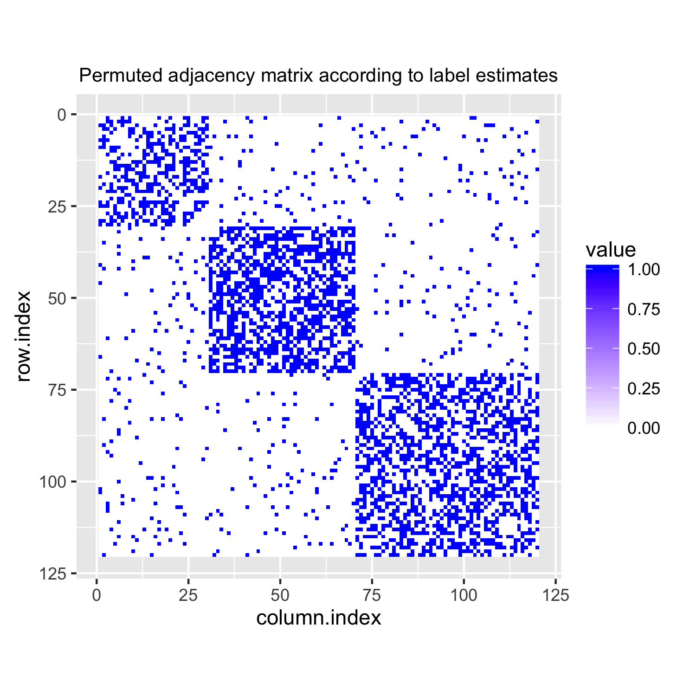

Birkhoff-Fan Clustering
=======================

`bfcluster` is an R package that provides an implementation of an ADMM
algorithm for computing the solution to an semidefinite program (SDP)
for both network community detection and multivariate data clustering. 
The ADMM algorithm is written in C++ using [Rcpp](http://www.rcpp.org) 
and the [Armadillo](http://arma.sourceforge.net) C++ library. 
The SDP treats the number of clusters as a tuning parameter, and 
the solver can compute a sequence of solution matrices over a 
sequence of candidate numbers of clusters. 
The package also provides several class methods for analyzing and visualizing
results and other utilities for clustering.
A manuscript describing the SDP and some of the statistical properties of 
its solution will be posted to [arXiv](http://arxiv.org).

Installation
------------

Use [devtools](https://github.com/hadley/devtools) to install directly from GitHub:

```R
library(devtools)
install_github("zhifeiyan/bfcluster")
```

Example Usage
-------------

```R
library(bfcluster)
library(ggplot2)
set.seed(201612)

# Generate a random adjacency matrix from a network model with community structure
adj <- gen_adjmat(n = 120, k = 3, sizes = c(30, 40, 50), 
                  p_min = 0.3, p_max = 0.6, 
                  q_min = 0.01, q_max = 0.05, 
                  type = "sbm", self_loop = FALSE, perm = TRUE)$adjmat
p_adj <- plot(adj)
p_adj <- p_adj + ggtitle("An adjacency matrix with three communities")
print(p_adj)
```

<p align="center">

</p>

```R
# Compute SDP solution matrix
sol <- bfcluster(adj, nclust = 3, admm_penalty = 10)
plot(sol, k = 3, perm = TRUE)
```

<p align="center">

</p>

```R
# Permute the adjacency matrix using label estimates obtained from SDP solution
perm_id <- permute(sol, k = 3)$perm_id
p_perm_adj <- plot(adj[perm_id, perm_id])
p_perm_adj <- p_perm_adj + ggtitle("Permuted adjacency matrix according to label estimates")
print(p_perm_adj)
```

<p align="center">

</p>
